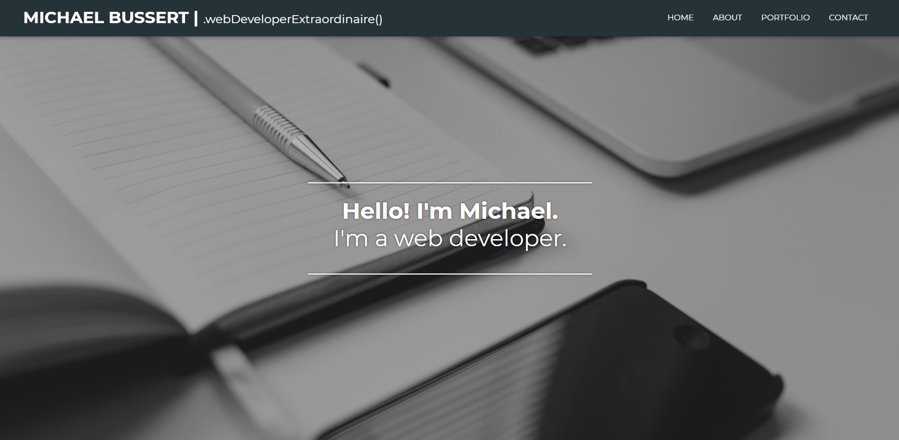
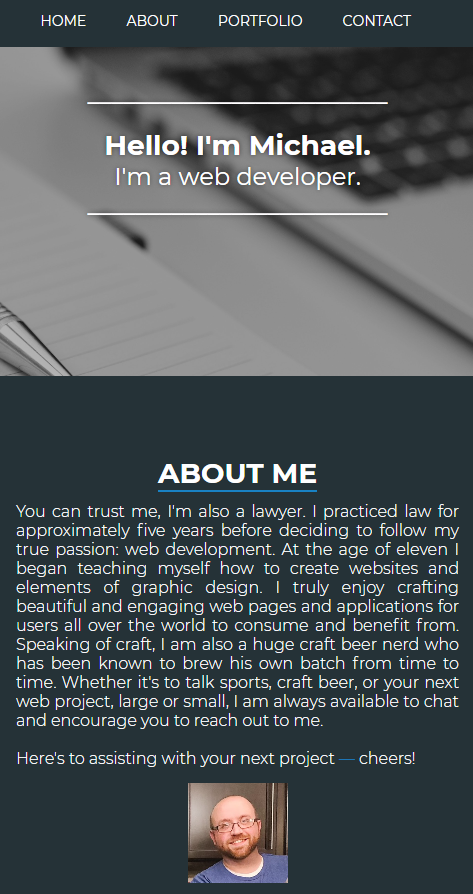

# mbussert-portfolio
My first portfolio website

## MSU Coding Bootcamp Portfolio Website Project
### by Michael Bussert
### GitHub: [mbussert](https://github.com/mbussert) | Email: mbussert@gmail.com

## Links:
Deployed application: https://mbussert.github.io/mbussert-portfolio/  
GitHub Repository: https://github.com/mbussert/mbussert-portfolio

## Description:
---------------------------------
I created a single page scrolling website with a responsive parallax effect utilizing only HTML and CSS.  I know this effect can be achieved much easier with JavaScript, however, with this project I really wanted to test myself. The page consists of four main sections, the top or intro, about me, portfolio, and how to contact me. The page is fully responsive down to tablets and smart phone resolutions.  The portfolio section was created with flexbox and CSS grid, which is fantastic and seems incredibly powerful for creating layouts.

----------------------------------------
### Screenshots

### Full Resolution

### Mobile Resolution
